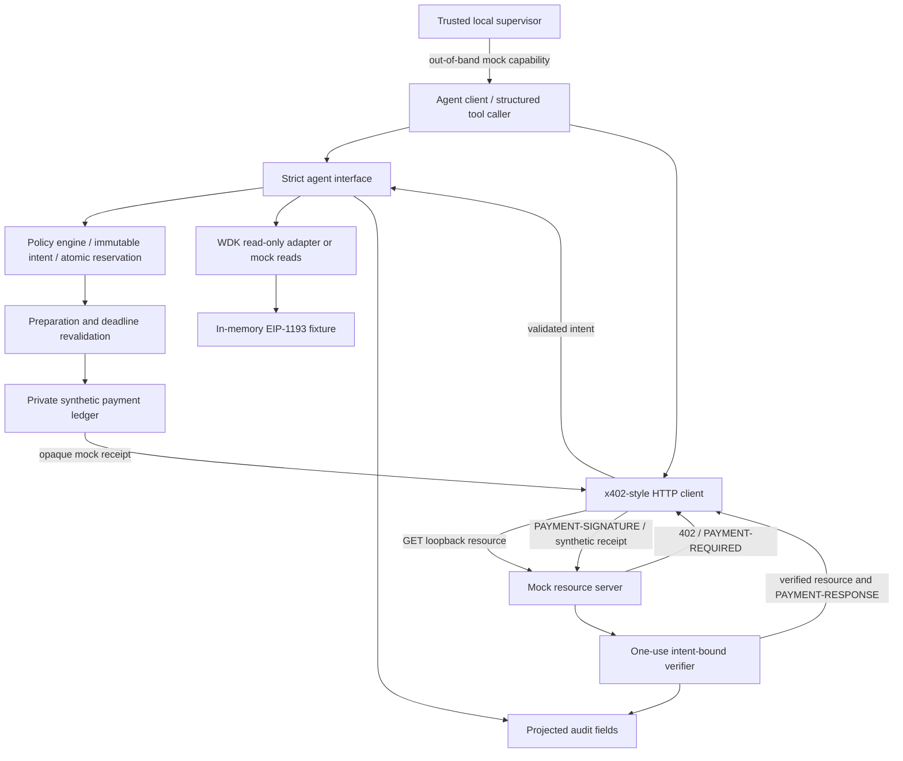
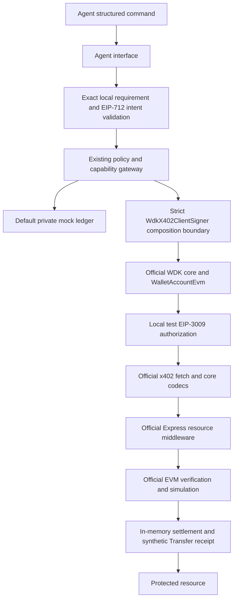

# Architecture

The default MVP remains strict TypeScript on Node 24 with zero core runtime dependencies. The separate optional profile now installs official WDK core/EVM and x402 reference packages. Explicit `wdk-test` uses deterministic generated test-only material and an in-memory read provider. Its directory is not process isolation; agent facades expose no raw signer or broadcast method.

The logical payment client encounters a challenge before it invokes wallet/policy authorization. A ledger receipt never represents an on-chain transaction. The gateway owns the only balance-decrement path; callers receive no raw executor. MCP is a future transport adapter over the gateway, not a claimed implemented server. Upstream MCP tooling already provides a server and confirmation; this MVP does not replicate its wallet tools or register its write tools outside policy.

## Components and contracts

| Component | File | Contract |
|---|---|---|
| Agent interface | src/sandbox.ts | `agent.call(command, capability, signal?)`; wallet.address/balance READ, payment.purchase WRITE; exact keys |
| WDK adapter | integrations/wdk/adapter.mjs | Official `WalletAccountReadOnlyEvm` constructor, fixed public fixture address, in-memory RPC; getAddress/getBalance only |
| Policy | src/policy.ts | Atomic integer mock units; transaction/session/UTC-day caps; strict local-only allowlists; default reject unknown contracts |
| x402-style client | src/x402.ts | v2-shaped challenge and headers, one synthetic offer, pinned numeric loopback origin, no redirects, bounded payloads |
| Protected server | src/server.mjs | GET /resource, 402, challenge store, verifier, returned mock receipt; bound 127.0.0.1 on ephemeral port |
| Mock environment | createSandbox factory | Private receipts/balance; host authorization inaccessible through tool commands |
| Audit | src/audit.ts | Fixed field projection, bounded in-memory ring, JSON lines export |
| Tests | tests/ | Node test runner, deterministic clock fixtures and ephemeral HTTP servers |

## Policy state machine

Parse → authorize agent → snapshot intent → evaluate → prepare without payment writes → validate prepared fields → recheck capability/cancellation/expiry → atomically reserve → dry-run or synthetic settlement → server verifies exact expected intent and consumes receipt once → resource.

Failed preparation causes no debit. Reservations and replay records are not refunded after execution failure. Paid-but-unverified outcomes remain accounted and are not automatically retried. Cancellation propagates to preparation; even a callback that ignores cancellation cannot later invoke the private ledger. Single-process synchronous reservation prevents overspending races; this is not a distributed database transaction.

## Safety boundaries and limits

- Host/supervisor code, policy, dependencies and injected test callbacks are trusted. An adversarial agent supplies data commands, not arbitrary JavaScript in the supervisor process.
- Out-of-band credentials authorize mock tool use only; they are never sent to the resource server or logged. Receipt UUIDs are transient mock capabilities, not keys/signatures; they are omitted from audit logs.
- Synthetic network `sandbox:local`, asset `mock:USDT0`, contract `mock:usdt0-contract`, recipient `mock:resource-merchant`. Mock limits use 6-decimal fixture accounting and have no market value.
- No financial EIP-3009 payment, external facilitator/RPC URL, mainnet fallback or external settlement exists; the optional profile signs only generated local test authorizations. The custom `sandbox-exact` scheme deliberately cannot be confused with an interoperable `exact` payment.
- Daily/session accounting and nonce records last for one process. Restarts reset them. Safe because there are no real funds; a future financial deployment needs durable transactional storage, reconciliation and cross-process locking.
- Replay storage fills then denies new payments; audit storage is a bounded ring. Export audit before termination if evidence retention is required. It is not a tamper-evident durable ledger.

## Upstream versus new code

Official Tether code supplies WDK orchestration, wallet derivation/reads and typed-data test signatures. Official x402 Foundation reference code supplies client/fetch/HTTP codecs, Express resource middleware, EVM authorization/verification/settlement abstraction. Our code supplies the strict local profile, original policy/capability/reservation gate, projected audit, simulated contract/settlement, adversarial tests and reproduction evidence. No community facilitator is installed/contacted. WDK Agent Skills remain documentation. Exact ownership/provenance/status: UPSTREAM-INTEGRATION.md and FINAL-TECHNICAL-GATE.md.

## Optional official local profile

The library prepares EIP-712 data before the gate; the only product signing call occurs after exact chain/token/recipient/domain/types/value validation and successful original gateway reservation. Fixture rails map to the original mock accounting units; the underlying PolicyEngine still accepts mock rails only. The projection is fixed, not an arbitrary network/asset mapping. Session/day/replay/concurrent reservations remain centralized in src/sandbox.ts and src/policy.ts. A raw SDK instance is used separately only in host-only compatibility fixtures, never exposed by the product agent facade.

The HTTP client bounds challenges/receipts, pins numeric loopback GET, rejects redirects and unsupported extensions, propagates deadline signals, requires a policy-authorized signature before accepting a resource, and validates settlement response fields. It cannot prove an arbitrary malicious seller performed honest settlement. The local facilitator executes official cryptographic verification and simulated contract reads/writeContract/Transfer receipt validation, with no blockchain transport or transaction signer. Repeated canonical requirement hashes are conservatively denied within a session.

## Strict compatibility boundary

The official client registers WdkX402ClientSigner directly. It privately references only the actual WDK getAddress/signTypedData methods. The async factory path initializes and validates the account address, then exposes the narrowed address getter and exact typed-data signing operation. No optional transaction/approval methods are implemented. The original product policy remains above signing: exact challenge validation -> adapter conversion -> host policy callback -> original sandbox capability and budget reservation -> post-gate expiry recheck -> local WDK authorization -> validated signature -> official client payload. Host-only success callback updates counters without receiving secret material.

Typed data is rebuilt explicitly from the exact supported schema; policy data is frozen and WDK receives distinct field arrays. Concurrent calls and nonce reuse fail closed; state capacity is bounded. Since a new private signer is constructed per client, cross-call replay protection remains in the centralized original gateway, not the per-instance signer set. Default-deny construction prevents direct ungated signing. Arbitrary host code can import test fixtures and supply trusted callbacks; this is documented supervisor authority, not executable-agent isolation.

Supported strict assignment is exercised by signer-adapter-compatibility.ts. The unchanged signer-compatibility.ts and byte-identical upstream-direct-signer-compatibility.ts retain upstream TS2322. Normal project compilation explicitly includes the supported adapter fixture only. The direct raw WDK runtime fixture is separate, host-only and preserved. These three outcomes are never combined into one compatibility label.
