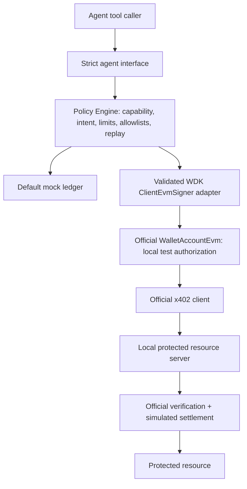

# WDK Agent Payment Sandbox

[](https://github.com/h2so4nackl-code/wdk-agent-payment-sandbox/actions/workflows/conformance.yml)

**Security-focused WDK/x402 conformance and policy sandbox for agentic payments.**

An autonomous agent can encounter a payment request while fetching data. A successful wallet demo does not show whether a malicious challenge, retry, substituted recipient or delayed authorization can cause an unintended payment. This project makes those boundaries executable: a Policy Engine sits above execution, and an adversarial conformance harness checks both allowed and rejected flows.

**Working release candidate:** 136/136 runtime tests, including 34/34 new signer-adapter tests. Official Tether WDK core/EVM and x402 Foundation packages are exercised locally. No wallet funding, real credentials, mainnet or blockchain broadcast is required. The source repository is public. Publication does not expand the supported sandbox profile or authorize real payments.

## Quick start: offline mock sandbox

Requires Node 24.16.x (verified 24.16.0) and npm (verified 11.13.0). From a source checkout/archive:

```sh
npm ci --ignore-scripts
npm test
npm run demo
npm run verify
```

The demo binds an ephemeral numeric loopback port, requests a protected resource, receives HTTP 402, evaluates a synthetic payment, verifies a one-use receipt and returns the resource. npm test runs 77 core tests; demo/tests work offline after installation. The mock mode has zero runtime dependencies. npm ci installs only the locked compiler for typecheck/build/lint. No .env values are required; do not add wallet secrets.

## Architecture



The host supervisor grants a bounded operation capability. Agents receive only structured gateway calls, never host authorization functions or raw WDK write methods. Every exposed payment write follows the existing policy reservation before signing. The official library may prepare typed data first; preparation does not authorize execution. [Architecture](ARCHITECTURE.md) and [security assumptions](SECURITY.md).

## Official WDK/x402 profile

```sh
npm ci --prefix integrations/wdk --ignore-scripts --omit=optional
npm run test:official
npm run test:all
npm run typecheck
npm run typecheck:adapter
npm run scan:test-material
```

The 59 official-profile tests use actual WDK account derivation/reads and EIP-712 cryptography, official x402 fetch/core/EVM/Express code, a loopback HTTP server and an in-memory facilitator. Successful verification releases a protected resource; settlement changes fixture state only. The combined total is 77 core + 59 official = 136; the 34 adapter tests are a subset, not an additional total. No internet/test RPC is required at runtime.

Supported profile: **WDK EVM; EOA; EIP-3009; x402 v2 exact; chain 31337; fixed simulated token, recipient and domain**. WDK core 1.0.0-beta.18, EVM 1.0.0-beta.20; @x402/core, evm, fetch and express 2.28.0. WDK remains beta. Other chains/assets, Permit2/approvals, EIP-1271, compact signatures, v1 and real settlement are unsupported here. This is not complete x402 coverage or mainnet readiness. [Conformance matrix](X402-CONFORMANCE.md).

Test wallet material is generated deterministically in memory from a deliberately public fixture label. Anyone can reconstruct it. **Never fund, reuse or import it into a real wallet.** It is not kept secret and offers no financial security. Its derivation material is not serialized into logs/evidence; dedicated tests and a reconstructed-material scan check this property. The provider rejects every non-read RPC method; transaction signing/broadcast is not exposed.

## Policy and adversarial coverage

Per-transaction, session and UTC-day caps; recipient/network/token/contract allowlists; explicit intent; preparation validation; default rejection; supervisor capabilities/revocation; atomic reservations; duplicate/replay protection; deadlines/cancellation; dry-run with zero payment writes; bounded projected audit logs. config.example.json and fixtures/policy.dry-run.json are safe examples. externalSpendLimit stays zero; configuration cannot enable financial rails.

Tests cover malformed/hostile requirements, substitutions, unauthorized direct writes, retry/concurrency, expiration, dry-run, verification/simulation/network failures and secret-bearing SDK exceptions. [Testing](TESTING.md), [threat model](THREAT-MODEL.md), [publication audit](PUBLICATION-AUDIT.md).

## Compatibility Findings

Direct WDK runtime EIP-3009 creation and official cryptographic verification pass. With the installed package versions, direct published TypeScript assignment to ClientEvmSigner fails TS2322. Our strictly typed composition adapter validates address, typed data and signature shape; no upstream declarations are patched. A frozen no-cast fixture preserves the discrepancy separately from the successful project compile.

```sh
npm run typecheck:adapter                # Supported project contract: PASS
node scripts/upstream-direct-evidence.mjs # Expected-diagnostic evidence gate
npm run typecheck:upstream-direct        # Currently exits 2 with TS2322
```

The negative fixture is not an ordinary success-required project compile. The evidence step reports drift if the known diagnostic disappears, prompting review after an upstream fix. A documentation-version clarification PR was found; it does not resolve the installed declaration mismatch. No issue was submitted or acknowledgment claimed. [Type gap](WDK-X402-TYPE-GAP.md), [unsubmitted issue draft](UPSTREAM-ISSUE-DRAFT.md).

## Quality, reproducibility and CI

```sh
npm run typecheck
npm run lint
npm run build
npm run scan:secrets
npm run scan:test-material   # Requires optional profile
npm run demo
node scripts/check-supply-chain.mjs
```

Lint is a dependency-minimal AST/syntax check, not ESLint. Pattern scans are heuristic. Current online npm audit reports show zero known critical/high/reachable vulnerabilities; this is not a formal audit or security certification. Exact official package names, repositories, locks, archive integrity and registry signatures are recorded in evidence/public/. Full native build/SLSA provenance is not asserted. [Dependency review](DEPENDENCY-AUDIT.md).

The manual GitHub Actions workflow targets Ubuntu 26.04 and windows-latest, installs with scripts disabled and needs no secrets. Windows local reproduction is verified; hosted Ubuntu/Windows conformance passed on main at commit 636d6a94fc25dabe88a97c35a22df0c527c4d7c0 ([run 37224889693](https://github.com/h2so4nackl-code/wdk-agent-payment-sandbox/actions/runs/37224889693)). [Publication audit](PUBLICATION-AUDIT.md).

Use npm run reproduce then npm run reproduce:official when a verified project-local npm cache exists. Release validation additionally checks a clean archive of an exact local Git commit: npm run reproduce:git (receipt written locally to evidence/release/committed-snapshot.json). No public repository URL is fabricated. Raw machine-specific historical logs/caches remain local and excluded; public evidence is explicitly curated.

On a Windows host where Node HTTPS is unavailable but existing PowerShell HTTPS works, the optional npm run acquire:upstream helper populates only integrity-checked public archives in a project cache. npm run audit:online uses a restricted public-advisory bridge. Normal npm users need neither helper. These tools change no networking settings.

## Ownership and limitations

| Code | Role | License/source |
|---|---|---|
| Our project | Policy gateway, strict adapter, local fixtures, audit projection, conformance/security tests and developer tools | Apache-2.0; this repository |
| Tether WDK | Official wallet orchestration, EVM account reads and test authorization cryptography | Official @tetherto packages; beta; upstream Apache-2.0 |
| x402 Foundation | Reference clients/codecs/Express middleware and EVM verification/settlement abstraction | Official @x402 packages; upstream Apache-2.0 |
| Other dependencies | Compiler, cryptographic/runtime and HTTP libraries installed from lockfiles | Their own permissive licenses; THIRD-PARTY-NOTICES.md |

No third-party wallet wrapper/community facilitator is used. No Tether endorsement, formal audit or financial security certification is claimed. The host process/dependencies are trusted; hostile executable agents need process isolation. Budgets/nonces reset on restart and are not distributed. A seller receipt alone cannot prove honest economic settlement or fair exchange. No real funds or credentials should be introduced.

## Project map

src/ — policy, gateway, mock x402 client/server and demo. tests/ — 77 core tests. integrations/wdk/ — pinned official profile, strict signer adapter and 59 tests. scripts/ — quality/reproduction/acquisition tools. evidence/public/ — curated public results, provenance and frozen mismatch evidence. .github/workflows/ — prepared CI. Root Markdown files — architecture, security, compatibility, release and grant package.

[License](LICENSE) · [Third-party notices](THIRD-PARTY-NOTICES.md) · [Maintenance proposal](MAINTENANCE.md) · [Grant deliverables](GRANT-DELIVERABLES.md). The owner has authorized hosted CI and publication of v0.1.0 after successful conformance on the release snapshot. Issue submission and grant submission each require separate explicit owner authorization.
